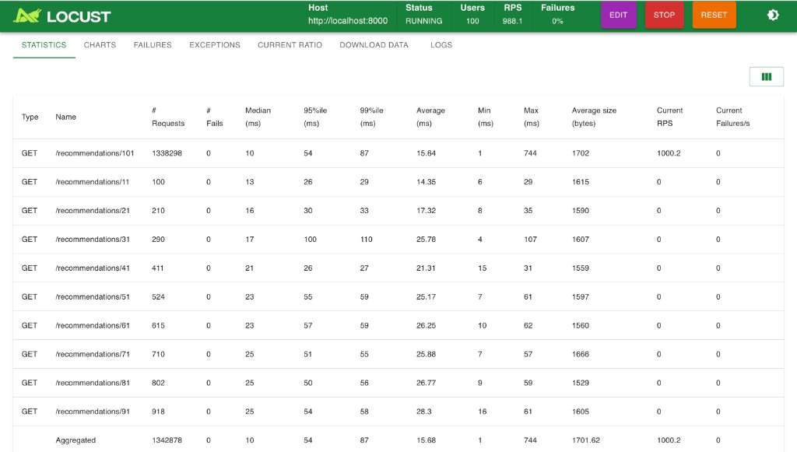

# Real-Time ML Recommendation API

**Author:** Ricky Johnson Ganta

## Why I Built This

Recommendation APIs are easy to sketch in a notebook but hard to run like a real product: you need fast reads under bursty traffic, a place to store interactions, something sane for cold users, and enough telemetry to know when the system—not just the model—is misbehaving. I built this project to practice that full path end-to-end: a FastAPI service backed by Postgres and Redis, hybrid collaborative + content scoring on MovieLens data, cache-friendly precomputed lists, Prometheus metrics, a small Streamlit surface to watch the system, and Locust runs to prove the read path stays stable at high RPS with clear guardrails (rate limits and an explicit load-test bypass for local benchmarking).

## Tech Stack

- **API & serving:** FastAPI, Uvicorn, Pydantic Settings
- **Data stores:** PostgreSQL (SQLAlchemy), Redis (precomputed recommendation lists + cache)
- **ML / ranking:** scikit-learn (user–user style collaborative filtering, TF–IDF content features, hybrid blend)
- **Dataset:** MovieLens `ml-latest-small` (ingested via `scripts/ingest_movielens.py`)
- **Experimentation / UI:** Streamlit admin dashboard (`dashboard/app.py`)
- **Load testing:** Locust (`locust/`, Makefile targets)
- **Observability:** Prometheus text metrics on `/metrics`
- **Offline evaluation:** Jupyter + Surprise SVD notebook (`notebooks/model_training_and_eval.ipynb`) for RMSE/NDCG experiments separate from the online sklearn pipeline
- **Containers:** Docker Compose (API, worker, dashboard, Postgres, Redis)

## Load Test / Performance Results (recommendation read path)

Read-heavy Locust traffic against `GET /recommendations/{user_id}` (Redis-backed lists, load-test bypass header so local runs are not capped by the per-IP rate limit):

| Metric | Aggregated | `GET /recommendations/101` (bulk of traffic) |
|--------|------------|---------------------------------------------|
| **Requests** | 1,164,035 | 1,159,455 |
| **Failures** | 0 | 0 |
| **Median** | 11 ms | 11 ms |
| **p95** | 56 ms | 56 ms |
| **p99** | 89 ms | 89 ms |
| **Average** | 16.31 ms | 16.28 ms |
| **RPS (reported)** | ~1,000 | ~1,000 |



Details and how to re-run: `docs/benchmark_results.md`.

**Commands**

- Read-heavy UI: `make loadtest-read` → http://localhost:8089  
- Mixed read/write: `make loadtest-mixed`  
- Headless example: `./.venv/bin/python -m locust -f locust/locustfile_readonly.py --host http://localhost:8000 --headless --users 100 --spawn-rate 20 --run-time 2m`

Set `LOADTEST_BYPASS_TOKEN` in `.env` and confirm with `curl -s http://127.0.0.1:8000/health` → `"loadtest_bypass_configured": true`. The API enforces `RATE_LIMIT_PER_MINUTE` (default 100/min per IP) without that bypass.

## Demo video (Locust + RTML-API)

Screen recording: Locust + the recommendation API (`GET /recommendations/…`, local run).

<video src="https://github.com/user-attachments/assets/d6eea1e6-8227-481d-ab83-d5837059d657" controls playsinline width="100%"></video>

<details>
<summary><strong>How to replace or re-upload this clip</strong> (GitHub issue attachment → README)</summary>

GitHub embeds use a **`user-attachments`** URL from dragging a video into an issue/PR comment ([attaching files](https://docs.github.com/en/get-started/writing-on-github/working-with-advanced-formatting/attaching-files)). On a **free** plan, that video must be **under 10 MB** or you get `<!-- Failed to upload … -->`.

**ffmpeg** (Mac) example to shrink a screen recording before upload:

```bash
ffmpeg -y -i "$HOME/Desktop/your-recording.mov" \
  -vf "scale='min(1280,iw)':-2" -c:v libx264 -preset slow -crf 28 \
  -an -movflags +faststart \
  "$HOME/Desktop/readme-demo.mp4"
```

Then **[New issue](https://github.com/Rickyganta/RealTime-ML-API/issues/new)** → drag the small `.mp4` into the comment box → copy the `https://github.com/user-attachments/assets/…` URL → paste into the `<video src="…">` above (you can cancel the draft issue).

For larger demos, use a **GitHub Release** asset or an **unlisted YouTube** link instead.

</details>

## How to Run Locally

### Option A — Docker Compose (three steps)

1. **Clone and env:** `git clone` this repo, `cd` into it, copy `.env.example` to `.env`, and adjust any secrets (optional: set `LOADTEST_BYPASS_TOKEN` for Locust).
2. **Start the stack:** `docker compose up --build` and wait until the API is listening on port **8000** (Postgres **5432**, Redis **6379**, Streamlit dashboard **8501** inside Compose).
3. **Load data & open the app:** run `docker compose exec api sh -c "PYTHONPATH=. python scripts/ingest_movielens.py"` (first-time MovieLens ingest), then visit **http://localhost:8000/docs** and **http://localhost:8501** (dashboard uses `API_BASE=http://api:8000` in Compose).

### Option B — Python virtual environment (three steps)

1. **Python & deps:** `python3.11 -m venv .venv && source .venv/bin/activate`, then `pip install -r requirements.txt`, and copy `.env.example` → `.env` with `POSTGRES_URL` / `REDIS_URL` pointing at **localhost** (see `.env.example`).
2. **Dependencies up:** start Postgres and Redis on your machine (or run only `docker compose up -d postgres redis` from this repo if you want databases in Docker but the API on the host).
3. **Ingest & run:** `PYTHONPATH=. python scripts/ingest_movielens.py`, then `make dev-api` (API on **http://localhost:8000**) in one terminal and `make dashboard` (Streamlit on **http://localhost:8502**) in another.

If `uvicorn` / `streamlit` shims break after moving the repo folder, run `make repair-venv`. If you see `could not resolve host "postgres"`, your `.env` is using Docker hostnames outside Compose—use `localhost` for laptop runs (see `scripts/dev_api.sh`).

## Streamlit Community Cloud

The hosted app only needs **`dashboard/app.py`** plus `requirements.txt`. **`scikit-surprise` is intentionally not listed there**: Community Cloud often runs **Python 3.14**, and Surprise 1.1.4 fails to compile on that stack (Cython / NumPy typing errors). The **live API and dashboard** use **scikit-learn**, not Surprise.

- **Secrets:** In the Cloud app settings, set **`API_BASE`** to a reachable URL for your FastAPI service (for example a deployed API or a tunnel to your laptop). The dashboard defaults to `http://localhost:8000`, which will not work from Cloud unless you proxy it.
- **Python version:** In deploy **Advanced settings**, pick **3.11** or **3.12** if you ever add native extensions again; 3.14 is fine once Surprise is gone from `requirements.txt`.

## API (quick reference)

- `POST /users/{id}/interactions` — record rating  
- `GET /recommendations/{user_id}?n=10&strategy=hybrid|collaborative|content|ab_auto`  
- `GET /recommendations/{user_id}/explain`  
- `GET /metrics` — Prometheus text  
- `POST /admin/retrain`, `GET /admin/ab/results`, `GET /health`

## What the models do (online API)

- **Collaborative:** user–user style similarity (cosine) over rating vectors  
- **Content:** TF–IDF over genres/title text + cosine similarity  
- **Hybrid:** default `0.6 * CF + 0.4 * CB`  
- **A/B:** deterministic hash bucketing on `user_id`  
- **Retrain loop:** `app/jobs/nightly_retrain.py` (demo-style; replace with a real scheduler in production)

## Offline evaluation

The notebook `notebooks/model_training_and_eval.ipynb` uses **Surprise SVD** for classic offline metrics. The **running API** uses the sklearn stack above—same dataset, different serving path. For local notebook work, install extras with:

`pip install -r requirements-notebooks.txt`

(Use **Python 3.11–3.13** for that file if `scikit-surprise` wheels fail on newer interpreters.)

## A/B methodology (summary)

- Primary: CTR on recommendation impressions  
- Secondary: engagement / novelty / coverage (placeholders for a fuller product)  
- Significance: two-proportion z-test (`app/services/statsig.py`)  
- Guardrails: latency, errors, cache hit rate

## Production gaps (honest list)

- Object storage + versioned model artifacts, auth on `/admin/*`, Alembic migrations, distributed rate limiting, CI (unit + smoke load)
